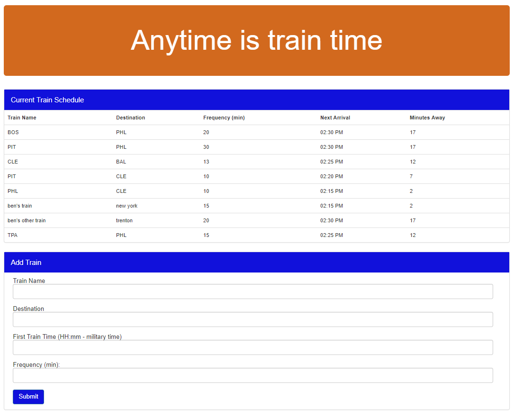

# :bullettrain_side: # Train-Scheduler

### Overview
Train schedule application that uses Firebase to host train arrival and departure data.  Users can add their own train schedules and Firebase safely stores it.

### Functionality
  1. <strong>See Schedule</strong> The home page lists all relevant data about existing train schedules.  There you will find the destination, frequency of departure, next arrival, and minutes away.
  2. <strong>Add a new Train Schedule</strong> Enter the name and destination of the train, plus the first departure time and the frquency and the new train is added to the existing schdeule.
  3. <strong>Refresh</strong> So you are always up to date, the page refreshed with the lastest train schedule every 60 seconds.

### Technology
* JS algorithms to calculate train departure and arrival times.
* Firebase database

### Screenshot

### DataBase
Firebase BD:
* https://console.firebase.google.com/project/trainscheduler-41970/database/trainscheduler-41970/data

